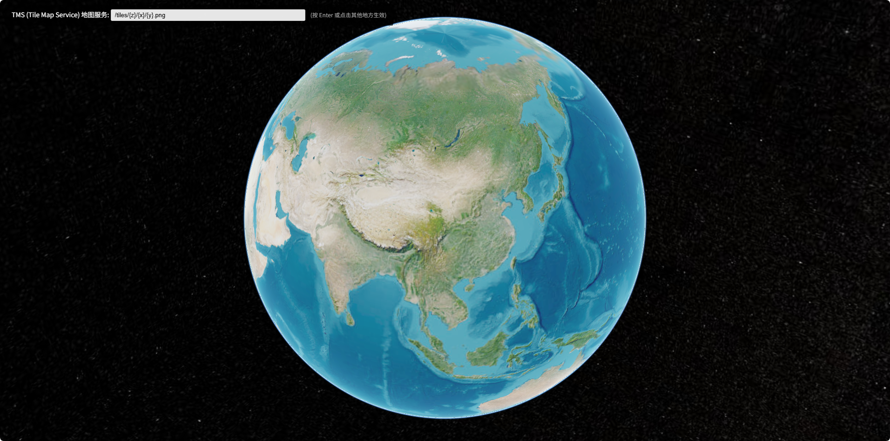

# map-tms-server-test

基于Cesium用于测试TMS服务地址是否可用

球用的Cesium1.141.0



# 地址参数

xxx.xx.xx?url='xxx'

传参url通过 encodeURIComponent(真实url值) 编码 
收的时候 通过 decodeURIComponent(地址栏参数拿到的url值) 解出来

示例
```js
// ============ 场景1: 生成带参数的 URL ============
const tileUrl = "https://webrd04.is.autonavi.com/appmaptile?lang=zh_cn&size=1&scale=1&style=7&x={x}&y={y}&z={z}";

// 编码
const encoded = encodeURIComponent(tileUrl);
// 结果: "https%3A%2F%2Fwebrd04.is.autonavi.com%2Fappmaptile%3Flang%3Dzh_cn%26size%3D1%26scale%3D1%26style%3D7%26x%3D%7Bx%7D%26y%3D%7By%7D%26z%3D%7Bz%7D"

// 拼接 URL
const fullUrl = `?url=${encoded}`;
// 结果: "?url=https%3A%2F%2Fwebrd04.is.autonavi.com%2Fappmaptile%3Flang%3Dzh_cn%26size%3D1%26scale%3D1%26style%3D7%26x%3D%7Bx%7D%26y%3D%7By%7D%26z%3D%7Bz%7D"

// ============ 场景2: 从 URL 中获取并解码 ============
// 假设 window.location.search = "?url=https%3A%2F%2Fwebrd04.is.autonavi.com%2Fappmaptile%3Flang%3Dzh_cn%26size%3D1%26scale%3D1%26style%3D7%26x%3D%7Bx%7D%26y%3D%7By%7D%26z%3D%7Bz%7D"

const params = new URLSearchParams(window.location.search);
const encodedValue = params.get("url"); // 获取编码后的值
const decodedValue = decodeURIComponent(encodedValue); // 解码
// decodedValue = "https://webrd04.is.autonavi.com/appmaptile?lang=zh_cn&size=1&scale=1&style=7&x={x}&y={y}&z={z}"
```